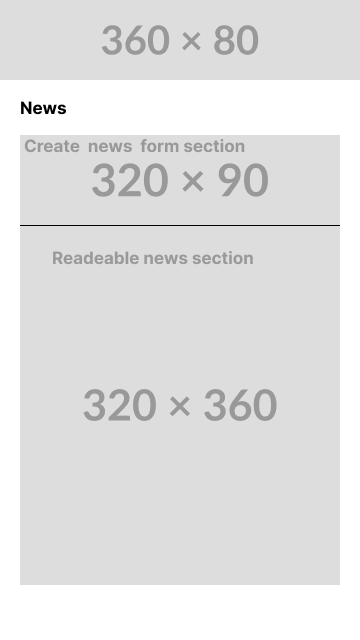
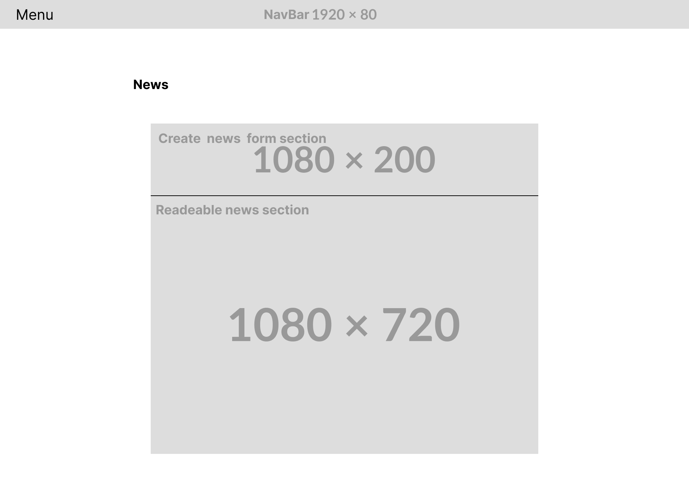
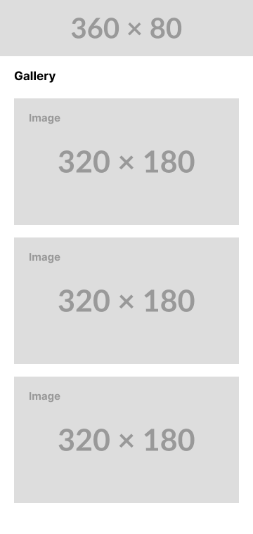
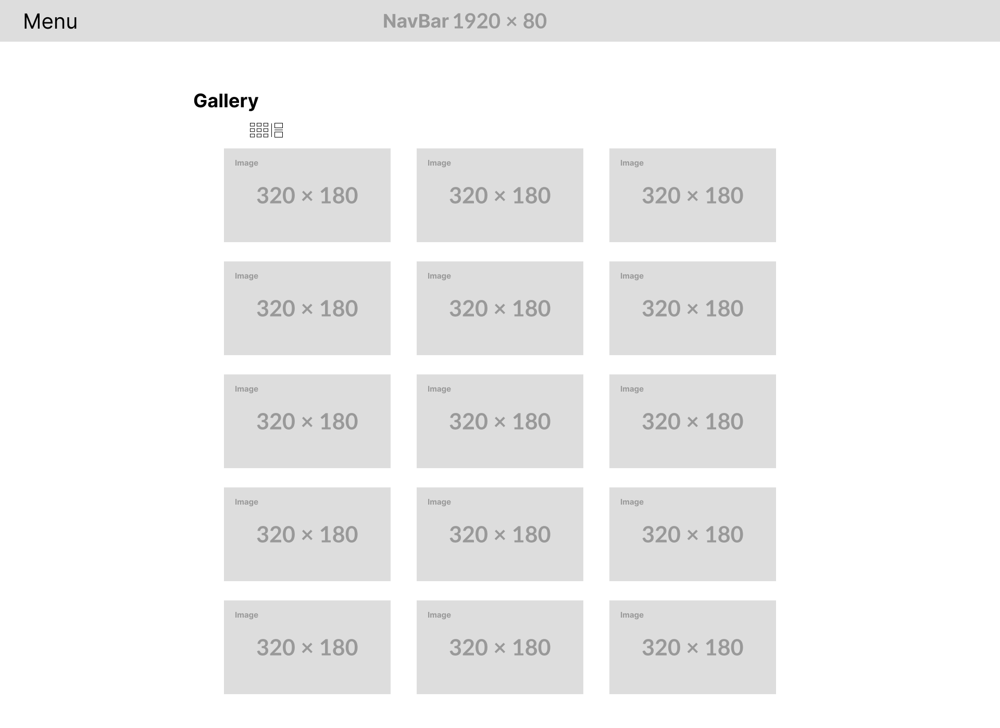
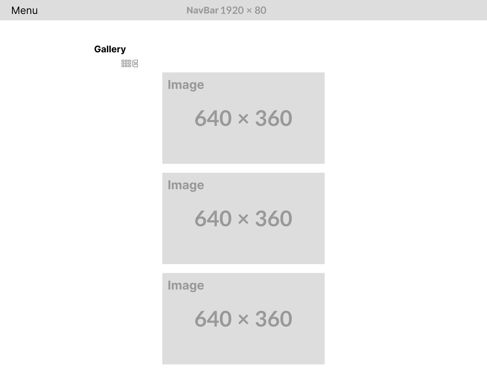
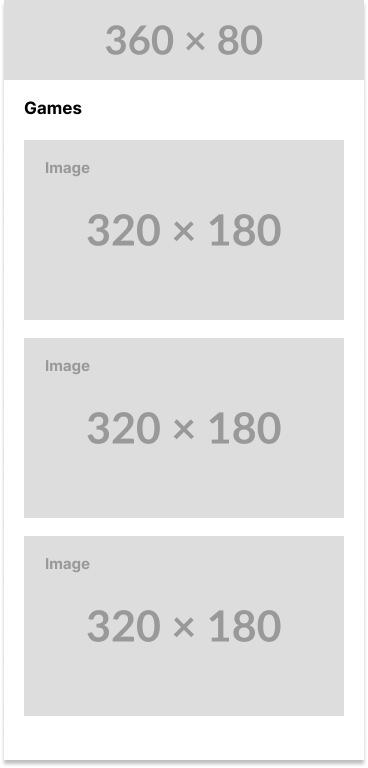
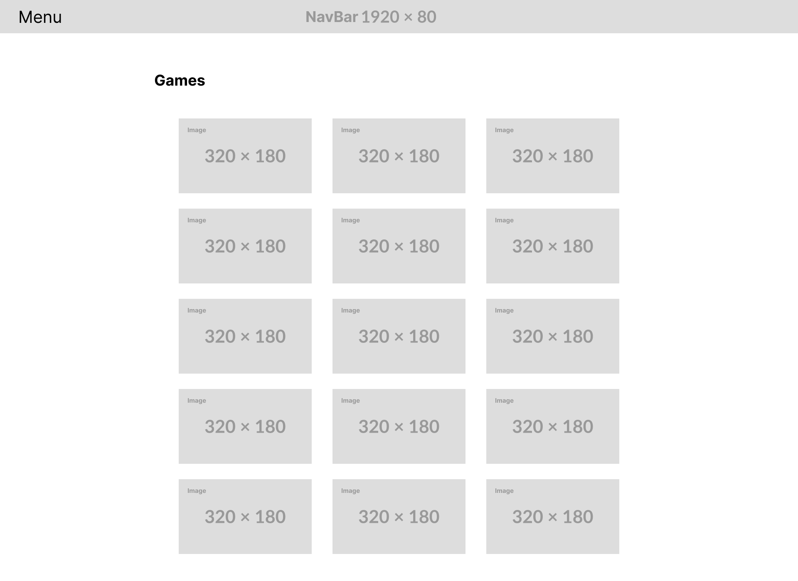

# games.lol

---
games.lol is a small personal project designed to practice JavaScript development. Its aim is not to find an audience but rather to serve as an exercise to improve my programming skills.

## Objective

The main goal of this project is to allow me to become familiar with key web development concepts, particularly with JavaScript. By working on this project, I can explore various features and techniques while solidifying my knowledge in this domain.

## Features

Currently, games.lol is a simple project with limited features. Here's what it includes:

- A minimalist user interface.
- Some examples of DOM manipulation in JavaScript.
- Ability to add new features as I progress in my learning.
- Integration with the [Tyradex Pokémon API](https://tyradex.tech/api/v1/pokemon)
- **Navbar in JavaScript connected to each page**
- **Drop down for navigation in the nav bar**
- **A route file in JavaScript**
- **Homepage with a feed, ability to add and delete created Pokemon**
- **Gallery page with a form to add and delete added Pokemon**
    - The form is hidden and appears upon clicking a button.
    - Display of added Pokemon in mosaic and column layouts.
- **Automatic and easily modifiable carousel of advertisements**
- **Game page with a grid of game choices linked to a game data file**
    - Launching a game opens a gameFrame that removes the previous content to display the game.
- **Games playable**
    - rock, paper, scissors !!! 

## Mockups
### Homepage
- Mobile

- Desktop

---
### Gallery
- Mobile

- Desktop mosaic

- Desktop column

---
### Games
- Mobile

- Desktop

---

More Details
I have provided more details about the project publicly on GitHub. You can find them in the [projects section](https://github.com/users/MateoNicoud/projects/1).

## How to Contribute

This project is not intended to receive external contributions as it is primarily a personal exercise. However, I am open to any suggestions or advice that could help me improve my web development skills.

## Technologies Used

- HTML5
- CSS3
- JavaScript

## License

This project is distributed under the [MIT License](./LICENSE.md). You are free to use, modify, and distribute it under the terms of this license.
